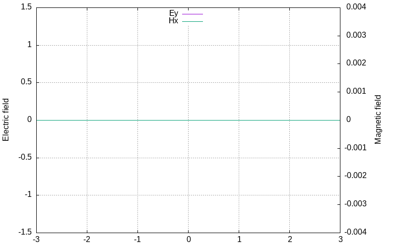
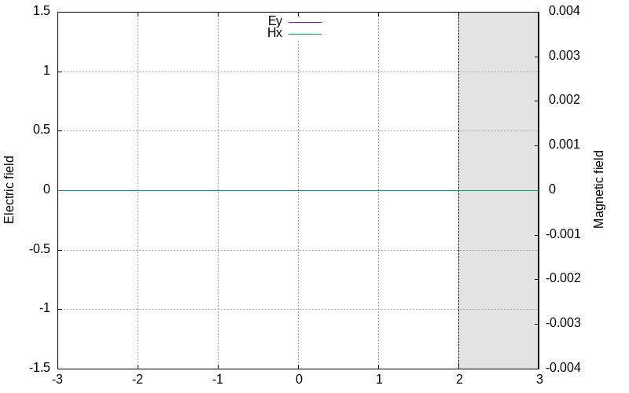
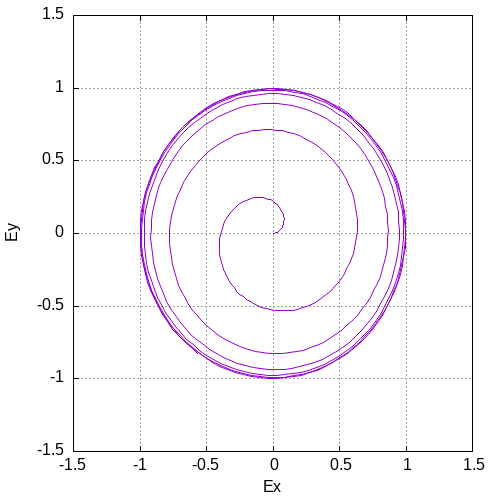

# 1D FDTD Simulator

A 1D Finite-Difference Time-Domain (FDTD) electromagnetic field solver written in C. 

---

## Features

* **Yee Grid Engine:** Staggered spatial ($\Delta z$) and temporal ($\Delta t$) electric and magnetic field updates.
* **Dynamic Sources and Plugins:** The simulator exposes interfaces for writing custom sources and analyzers which are compiled and loaded in runtime.

---

## Usage

Compile the core simulator with

```bash
make
```

Run the simulator with a config

```bash
./fdtd.out <your-config>
```

> **NOTE:**
> The executable must be run from the root repository directory (where include/analysis_interface.h and include/source_func.h are located).
> This ensures that your compiler can resolve include paths when building the plugins.
> Auto injection of headers is planned to be implemented in the future.

---

## Examples

> **NOTE:**
> The examples below use **Gnuplot** to render the outputs. Install Gnuplot on your system to run them
> ```bash
> # Ubuntu / Debian
> sudo apt-get install gnuplot
>
> # Fedora
> sudo dnf install gnuplot
>
> # Arch Linux / Manjaro
> sudo pacman -S gnuplot
> ```

### Pulse Propagation & Reflection
Below is an example output generated by running the simulator in vacuum for the domain `z = [-3,3]` with PEC at both ends:



Run this simulation:
```bash
./fdtd.out ee3140/q1.ini
```

### Transmission & Reflection
The same simulation as above, but with a dielectric of `ε_r = 3.2` introduced between `z = [2,3]`:



Run this simulation:
```bash
./fdtd.out ee3140/q2.ini
```

### Polarization
Polarization locus of the electric field plotted at `z = 4` with smooth turn-on sine waves:



Run this simulation:
```bash
./fdtd.out ee3140/q3.ini
```

The electric field components can be changed by modifying the sources in `ee3140/sources/sin.c`

---

## Config Format

The simulator uses the ini format to define domain parameters, materials,
sources and analysis plugins.

```ini
[simulation]
N = 6000              # Number of spatial cells in the grid
dz = 1e-3             # Spatial resolution (meters)
dt = 5e-13            # Temporal resolution (seconds)
steps = 40000         # Total number of simulation time-steps to run

[boundary]
left = PEC            # Boundary condition at index 0
right = PEC           # Boundary condition at index N

[material.vacuum]
eps_r = 1             # Relative permittivity
mu_r = 1              # Relative permeability

[region]
start = 0             # Starting cell index for this material region
end = 6000            # Ending cell index (exclusive) for this material region
material = vacuum     # Name of the material to assign to this region

[source]
position = 3000       # Grid node index where the source field is injected
type = Ey             # Field component to excite (Ex, Ey, Hx, Hy)
file = sources/sin.c  # Path to the C source file
function = pulse      # Exact function name exported inside the C file

[analyzer]
file = analyzers/plot.c # Path to the dynamic analyzer C plugin
init = init             # Function name to call during analyzer initialization
process = process       # Function name to call on every time-step iteration
finish = finish         # Function name to call upon simulation completion
```

The simulator supports defining multiple `[source]` and `[analyzer]` blocks.

A mesh is generated with `N` cells, each cell has the magnetic field nodes at its center,
and the electric field nodes at each end. So the final mesh has `N+1` Electric field nodes
and `N` magnetic field nodes.


> **NOTE:**
> The paths specified in `[file]` are relative to the working directory of the simulator.

---

## Writing a Custom Source

The simulator exposes the following parameters for the source

```c
typedef struct
{
    double t;
    double dt;
} source_context_t;

// Implement this function to apply a source
typedef double (*source_func_t)(const source_context_t *ctx);
```

### Example: Sinusoidal Pulse Source (sources/sin.c)

```c
#include <math.h>
#include "source_func.h"

double pulse(const source_context_t *ctx)
{
    const double freq = 1e9;
    const double t0 = 5e-9;
    const double T = 2e-9;

    double amp = exp(-pow((ctx->t - t0) / T, 2));
    double value = amp * sin(2 * M_PI * freq * ctx->t);

    return value;
}
```

## Writing a Custom Analyzer Plugin

The simulator exposes the following parameters for the analyzer

```c
typedef struct
{
    double t;
    double dt;
    uint32_t current_step;
    uint32_t N;
    double dz;
    const double *Ex;
    const double *Ey;
    const double *Hx;
    const double *Hy;
    void *user_data;
} analysis_context_t;

// Implement these functions to do any analysis
typedef void *(*analysis_init_func_t)(void); // Initalize and return user_data in this
typedef void (*analysis_process_func_t)(const analysis_context_t *ctx);
typedef void (*analysis_finish_func_t)(const analysis_context_t *ctx);
```

### Example: Plotter (analyzers/plot.c)

```c
#include <stdint.h>
#include <stdio.h>
#include <stdlib.h>

#include "analysis_interface.h"

typedef struct
{
    FILE *handle;
    float minX;
} plotter_t;

void *init(void)
{
    plotter_t *plotter = (plotter_t *)malloc(sizeof(plotter_t));
    plotter->handle = popen("gnuplot -persist", "w");

    if (!plotter->handle)
    {
        perror("gnuplot");
        return NULL;
    }

    fprintf(plotter->handle, "set term gif animate delay 3\n");
    fprintf(plotter->handle, "set output 'sim.gif'\n");
    fprintf(plotter->handle, "set xrange [-3:3]\n");
    fprintf(plotter->handle, "set ytics nomirror\n");
    fprintf(plotter->handle, "set yrange [-1.5:1.5]\n");
    fprintf(plotter->handle, "set grid\n");

    plotter->minX = -3.0;
    return plotter;
}

void process(const analysis_context_t *ctx)
{
    if (ctx->current_step % 100 != 0)
        return;

    plotter_t *plotter = (plotter_t *)ctx->user_data;
    uint32_t N = ctx->N;

    fprintf(plotter->handle, "$E << EOD\n");
    for (int i = 0; i < N; i++)
    {
        double x = i * ctx->dz + plotter->minX;
        double y = ctx->Ey[i];

        fprintf(plotter->handle, "%e %e\n", x, y);
    }
    fprintf(plotter->handle, "EOD\n");
    fprintf(plotter->handle, "plot $E u 1:2 w l smooth unique t 'E'\n");
}

void finish(const analysis_context_t *ctx)
{
    plotter_t *plotter = (plotter_t *)ctx->user_data;
    pclose(plotter->handle);
    free(plotter);
}
```

